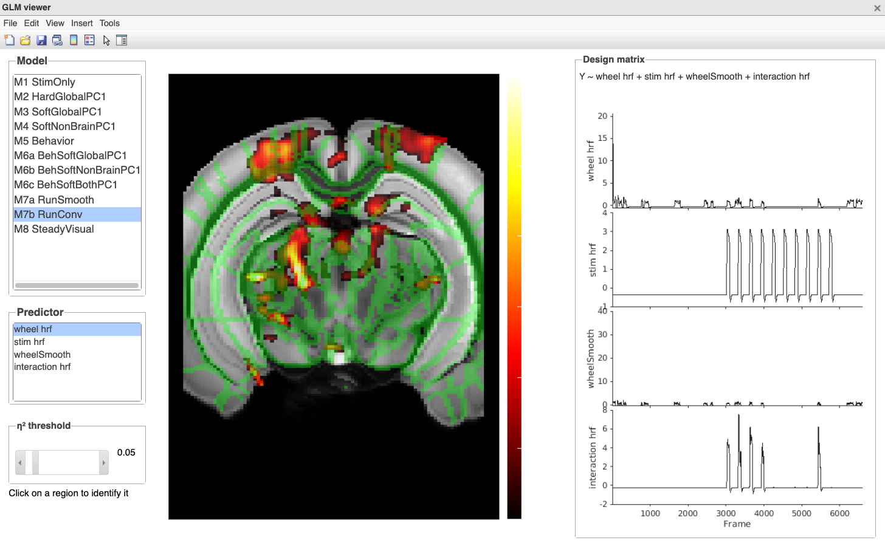
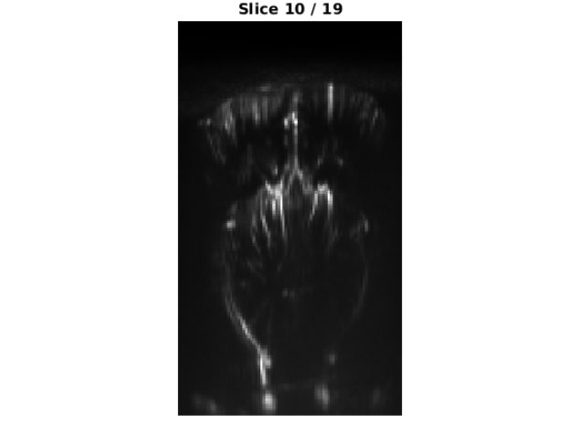
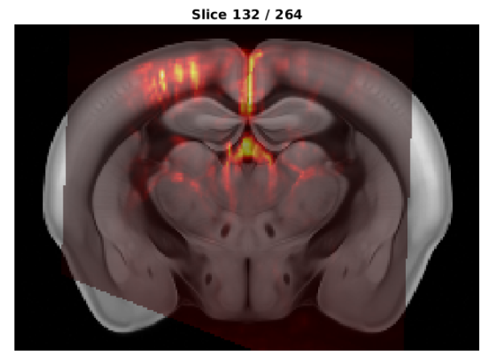
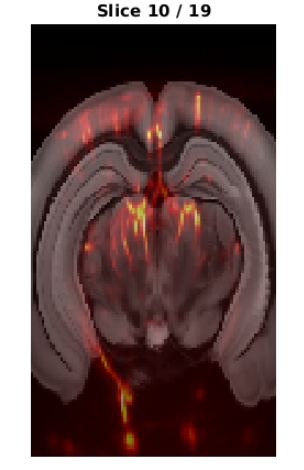
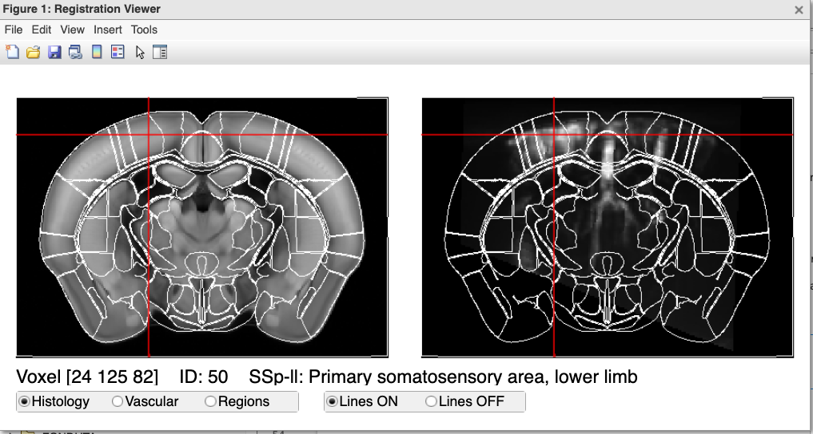
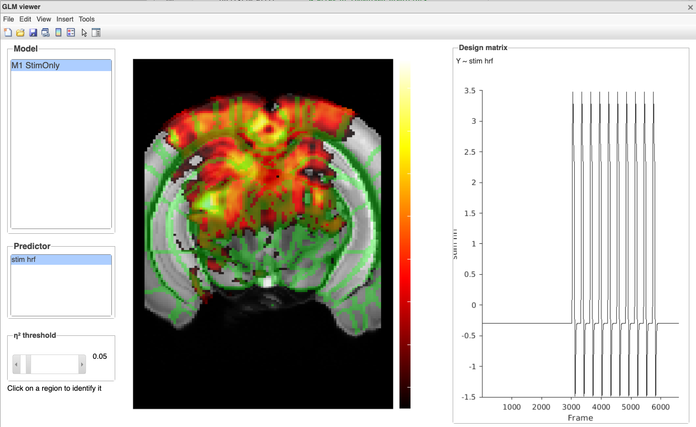

# FONDUTA TUTORIAL

The basic procedures to analyse a fUSI dataset can be listed as follow:
- registration of individual anatomic to the allen atlas and choice of the slice to acquire functional data
- reconstruction of anatomic and functional from the binary files
- preprocessing
- analysis (GLM)
- visualization

Here we will focus on the last two. There is a separate tutorial for the previous steps.

Throughout the analysis, it is fundamental to be able to inspect the images from time to time, in order to (e.g.)
- check for accurate registration with the atlas
- inspect the labels of the regions we have acquired
- identify the location of regions recruited by a certain task

In turn, this requires to be able to quickly transform the slice(s) from the individual space to the allen space.

Since visualization and transformation are basic procedures useful at different steps of the analyses, we will start from these, and then proceed to a sample GLM analysis.


# Importing FONDUTA
In order to use all the functions in the FONDUTA package (including the external libraries) we need to first add it to the path at the beginning of each script

```matlab
FONDUTA_PATH = '/data00/leonardo/github/fUSI_analyses/FONDUTA';
addpath(genpath(FONDUTA_PATH));
```

After that we can call or get help for one specific function, e.g. for viewing the results of a glm we use the `fonduta.viz.view_glm` function

```matlab
% help fonduta.viz.view_glm

results_dir='/data06/fUSIMethodsPaper/Data_analysis/sub-Group/VisualTest/Functional/LC'
fonduta.viz.view_glm(fullfile(results_dir, 'glm_run-142136.mat'));
```




# Load preprocessed data
The initial method for loading data uses a single `Datapath.m` script with an argument referring to the experiment whose data we want to load, e.g. `VisualTest`.

This file has now been moved to `FONDUTA.fonduta.io.datapath.Datapath.m`.

```matlab
FONDUTA_PATH = '/data00/leonardo/github/fUSI_analyses/FONDUTA';
addpath(genpath(FONDUTA_PATH));

% Load the filenames for the Visual test experiment
[subDataPath, subAnatPath, resultPath] = fonduta.io.datapath.Datapath('VisualTest');

% Load and display the anatomic image of one sub
anatPath = subAnatPath{1}
load(fullfile(anatPath, 'anatomic.mat'), 'anatomic')
fonduta.viz.view_image(anatomic.Data, [], 3)    % 3 = coronal
```




# Transformations 
## Individual -> Atlas
During acquisition, the 4x4 affine transformation matrix is estimated manually by overlapping the `anatomic` onto the allen atlas. This individual-to-atlas transformation is saved in `Transformation.mat`

To warp the individual volume into atlas space, we use `fonduta.atlas.individual2atlas()`. Nearest neighbour interpolation is used.

```matlab
output_anatomic2atlas = fonduta.atlas.individual2atlas(anatomic, atlas, Transf);
```

The `output_anatomic2atlas` has the dimensions of the atlas: 160x264x228

## Atlas -> Individual
Here we pass _the same `Transf` matrix_, but of course since we need to go from atlas to individual, internally the code uses the inverse of this transformation matrix.

```matlab
output_atlas2anatomic = fonduta.atlas.atlas2individual(atlas, anatomic, Transf)
```

The `output_atlas2anatomic` has the dimensions of the anatomic volume, e.g. 158x90x19.

## Examples
```matlab
% Load the atlas
atlas = fonduta.atlas.load_atlas()

% load the anatomic of one sub
anatPath = subAnatPath{1}
load(fullfile(anatPath, 'anatomic.mat'), 'anatomic')
load(fullfile(anatPath, 'Transformation.mat'), 'Transf')

% anatomic -> atlas
output_anatomic2atlas = fonduta.atlas.individual2atlas(anatomic, atlas, Transf);

fonduta.viz.view_image(atlas.Histology, output_anatomic2atlas)

% atlas -> anatomic
output_atlas2individual = fonduta.atlas.atlas2individual(atlas, anatomic, Transf);

fonduta.viz.view_image(output_atlas2individual.Histology.Data, anatomic.Data, 3)
```

| anatomic -> atlas | atlas -> anatomic |
| :--: | :--: |
|  |  |


## Optional arguments
In all cases, the entire volume is warped. This is the same as specifying the option `mode` to `volume`, which is the default. If the initial image to be warped is a single slice, it is first embedded in an empty volume, and then warped. 

If `mode` is set to `slice`, the fn reads the slice the experimenter selected for fusi acquisition in `anatomic.funcSlice(3)`, embed this in an empty volume of `size(anatomic.Data)` and warps this in atlas space after 3D interpolation in the voxel size of the allen atlas. 

It is also possible to save a nifti version of the warped volume/slice. The names for these volumes are standard: `anatomic_in_atlas.nii.gz` and `*`


Below there is an example call using these two optional arguments. See `eg_transformations.m` for more.

```matlab
output_anatomic2atlas = fonduta.atlas.individual2atlas( ...
    anatomic, atlas, Transf, ...
    'mode',       'volume', ...
    'save_nifti', true, ...
    'nifti_path', fullfile(outDir, 'anatomic_in_atlas.nii.gz') ...
    );
```

# Visualization

## `view_image()` - Simple Image + overlay
- Simple tool to inspect an image
- A second (optional) argument loads also an overlay
- Expects 3D or 2D matrices as input
- The last number (1/2/3) controls the orientation
- Mouse wheel to scroll across slices

**NB**: atlas and anatomic are acquired with different orientation, therefore it is necessary to use different orientation numbers (1/2/3) to see the coronal image when visualizing either the anatomic or the atlas.

```matlab
fonduta.viz.view_image(atlas.Histology, atlas.Regions, 2)
fonduta.viz.view_image(anatomic.Data, [], 3)
```

## `view_registration()` - View images in allen space
- Useful for checking registration and regions name
- Inputs: the atlas struct + an image which _must_ be in atlas space
- Atlas on the left, image on the right
- Switch between histology, vasculature, regions
- Display image lines on both images
- Click on a voxel to 
    - move the crosshair to the same location in both images
    - get info about the region name and acronym 

**NB**: for the moment, the anatomic/slice needs to be transformed manually. In a later version I might modify the api so that one can pass also the `Trans` object and the viewer takes care of the transformation.

```matlab
FONDUTA_PATH = '/data00/leonardo/github/fUSI_analyses/FONDUTA';
addpath(genpath(FONDUTA_PATH));

atlas = fonduta.atlas.load_atlas()

[subDataPath, subAnatPath, resultPath] = fonduta.io.datapath.Datapath('VisualTest');
anatPath = subAnatPath{1}

load(fullfile(anatPath, 'anatomic.mat'),       'anatomic');
load(fullfile(anatPath, 'Transformation.mat'), 'Transf');

output_anatomic2atlas = fonduta.atlas.individual2atlas(anatomic, atlas, Transf);

fonduta.viz.view_registration(atlas, output_anatomic2atlas)
```




# GLM Analysis
| Please refer to `eg_GLM_analysis.m` for the full script

To carry out a glm analysis, we need several kinds of information, most of which are contained in the preprocessed PDI struct.

Often we will need some bespoke functions. In this example we will carry out a simple GLM using all the trials of the Visual paradigm. The bespoke functions in the `glm_example` directory do the following:
- detect stationary and running visual trials
- build the visual predictor for all trials

In general, these bespoke function can be written to build the predictors from the acquired data, or from other sources of information (e.g. principal components of the data).

Once all the predictors have been generated (in this case there is only one) we can use the `fonduta.glm.ols` function:

```matlab
all_results.M1_StimOnly = fonduta.glm.ols( ...
    'M1_StimOnly', ...      % label of the model
    PDI.PDI, ...            % fusi data
    bmask, ...              % slice mask
    [hrf(stim_all)], ...    % array of convolved predictors
    [{'stim_hrf'}] ...      % array of predictor labels
    );      
```

The output is a struct with the following fields:

```matlab
>> fonduta.utils.tree_struct(all_results)
all_results (struct)
    M1_StimOnly (struct)
        betas [2x158x90 double]
        eta2 [1x158x90 double]
        R2 [158x90 double]
        Xmodel [6600x1 double]
        predictor_labels [1x2 cell]
        model_name [1x11 char]
```

Then we can visualize the results with 

```matlab
fonduta.viz.view_glm("glm_example/glm_run-142136.mat")
```



## Content of the saved `glm_[run-number].mat`
The .mat file which is saved with the results contains a lot of information, besides the statistical maps. Below you can see how to inspect them.

```matlab
% Load the results of a glm on a single subject

condition    = 'VisualTest';   % experiment condition (passed to Datapath)
resultFolder = condition;           % output subfolder name

resultPath = '/data06/fUSIMethodsPaper/Data_analysis/LC'

glm_results_path = fullfile(resultPath, resultFolder)

glm_results = load(fullfile(glm_results_path, 'glm_run-163615.mat')).data;

% % see all the nested fields at once
% fonduta.utils.tree_struct(glm_results)

% The outermost layer of the struct contains the anatomic and datapath, as
% well as other useful stuff like the individual -> atlas transformation
% and the mask of the selected functional slice
glm_results

%   struct with fields:
% 
%          dataPath: '/data06/fUSIMethodsPaper/Data_analysis/sub-methods04/ses-240108/run-163615/'
%          anatPath: '/data06/fUSIMethodsPaper/Data_analysis/sub-methods04/ses-240108/run-154044/'
%            Transf: [1x1 struct]
%             bmask: [158x90 double]
%      nonBrainMask: [158x90 logical]
%     allen_regions: [158x90 int16]
%        predictors: [1x1 struct]
%            models: [1x1 struct]


% The .predictors field contains the raw predictor before convolution.
% Whether a predictor requires or not convolution is determined by the
% formula passed to the glm
glm_results.predictors

%               condMat: {10x1 cell}
%              stim_all: [6028x1 double]
%       stim_stationary: [6028x1 double]
%                 wheel: [6028x1 double]
%           wheelSmooth: [6028x1 double]
%             globalPC1: [6028x1 double]
%           nonBrainPC1: [6028x1 double]
%      visualTrialIndex: [5x1 double]
%     runningTrialIndex: [5x1 double]
%     steadyExcludeMask: [6028x1 logical]

% For instance this plots the predictor for all the stimuli (visual in this case)
plot(glm_results.predictors.stim_all)
title('raw predictors (1 during stimulus, 0 elsewhere)')


% The models which were fitted are in .models. Each one is a struct with 
% the actual predictors used for that model, as well as labels and results
% (maps)
glm_results.models

%                M1_StimOnly: [1x1 struct]
%           M2_HardGlobalPC1: [1x1 struct]
%           M3_SoftGlobalPC1: [1x1 struct]
%         M4_SoftNonBrainPC1: [1x1 struct]
%                M5_Behavior: [1x1 struct]
%       M6a_BehSoftGlobalPC1: [1x1 struct]
%     M6b_BehSoftNonBrainPC1: [1x1 struct]
%         M6c_BehSoftBothPC1: [1x1 struct]
%              M7a_RunSmooth: [1x1 struct]
%                M7b_RunConv: [1x1 struct]
%            M8_SteadyVisual: [1x1 struct]

% To see all the predictors of all models you can use the following:
model_names = fieldnames(glm_results.models);

for i = 1:numel(model_names)
    model = model_names{i};
    fprintf('\n%s:\n', model);
    disp(glm_results.models.(model).predictor_labels)
end

% Differently from the .predictors field, the .models.(model).Xmodel 
% contains the predictors *after* hrf convolution, that is the actual
% predictors used in that model.
% The corresponding labels are in .models.(model).predictor_labels
model='M7b_RunConv'
visual_predictor_idx = 2 % always with label stim_hrf

plot(glm_results.models.(model).Xmodel(:,visual_predictor_idx))
title(glm_results.models.(model).predictor_labels{visual_predictor_idx},'Interpreter','none')

% These can also be visualized with fonduta.viz.view_design_matrix()
fonduta.viz.view_design_matrix(glm_results.models.(model))

% as well as when viewing the results of the glm
fonduta.viz.view_glm(fullfile(glm_results_path, 'glm_run-163615.mat'))


% the results of the glm analysis (maps in the single subject space) can be
% found in .models.(model), e.g.

glm_results.models.(model)

%                betas: [5x158x90 double]
%                 eta2: [4x158x90 double]
%                   R2: [158x90 double]
%               Xmodel: [6028x4 double]
%     predictor_labels: {'wheel_hrf'  'stim_hrf'  'wheelSmooth'  'interaction_hrf'  'intercept'}
%           model_name: 'M7b_RunConv'


% To view the results manually (without using fonduta.viz.view_glm) we can
% use fonduta.viz.view_image()
load(fullfile(glm_results.anatPath, 'anatomic.mat'), 'anatomic');
anatomic_funcslice = anatomic.Data(:,:,anatomic.funcSlice(3));

eta2 = squeeze(glm_results.models.M7a_RunSmooth.eta2(2,:,:));

fonduta.viz.view_image(anatomic_funcslice, eta2, 3)
```


## How `fonduta.glm.ols` works internally

`fonduta.glm.ols` is the user-facing entry point. It orchestrates three internal steps:

```
fonduta.glm.ols(name, PDI_3D, bmask, X, labels)
    │
    ├─ 1. prepare_data_matrix(PDI_3D, bmask)
    │       Flattens [nx × ny × T] → [T × V]
    │       where V = number of brain voxels (bmask == 1)
    │
    ├─ 2. engine(name, Y, X, labels)
    │       Fits OLS on the [T × V] matrix:
    │       - z-scores each column of X (adds intercept)
    │       - solves β = (X'X)⁻¹ X'Y  for all V voxels at once
    │       - computes partial η² per predictor and global R²
    │       Returns a flat [V-length] result struct
    │
    └─ 3. remap_results(glm_est, bmask)
            Maps flat [V] vectors back to [nx × ny] spatial images
            Output: .betas [p+1 × nx × ny], .eta2 [p × nx × ny], .R2 [nx × ny]
```


