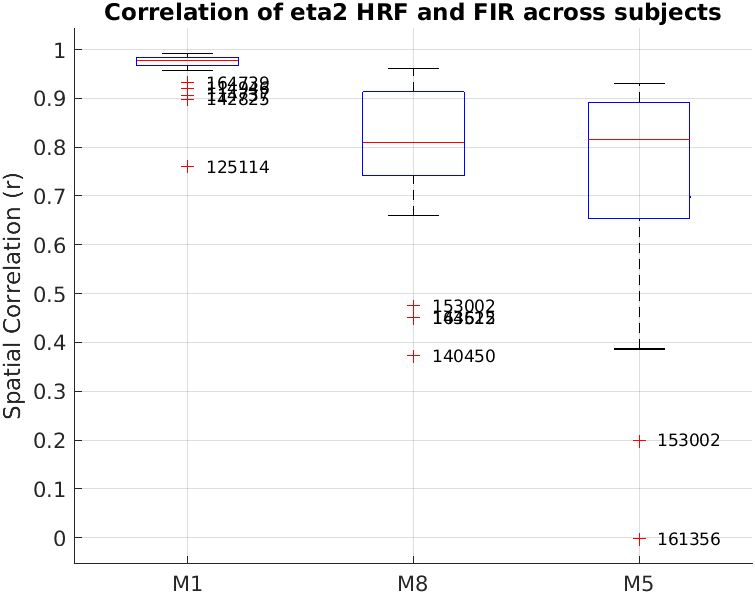
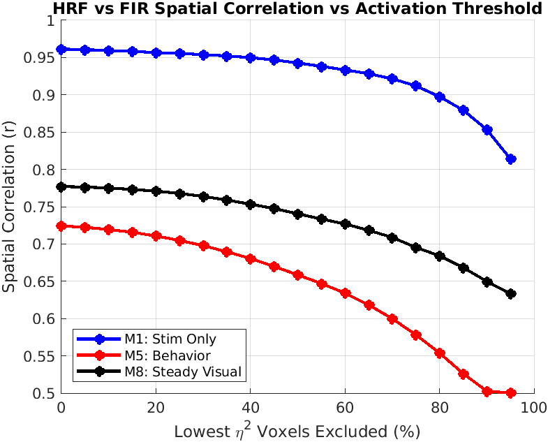
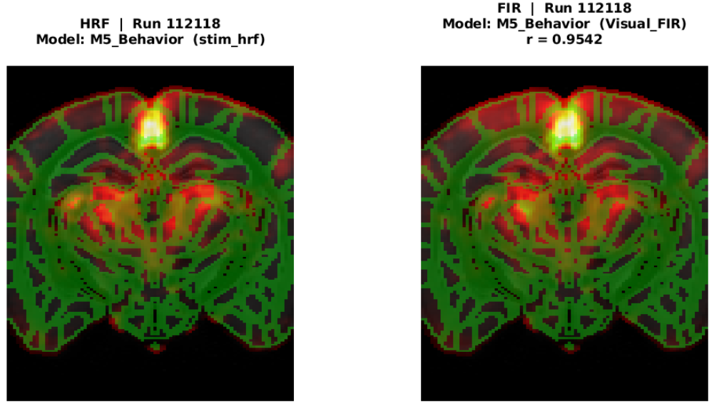
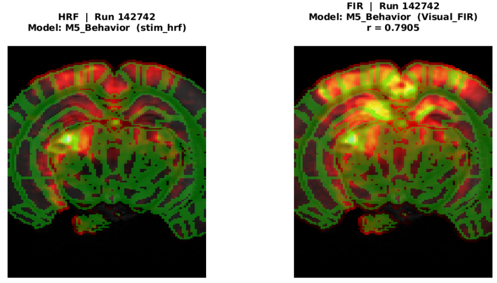
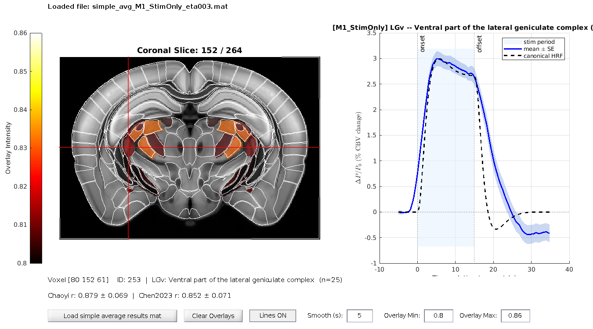
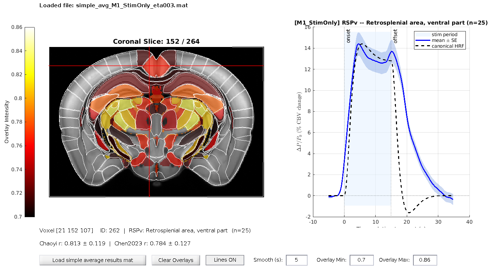
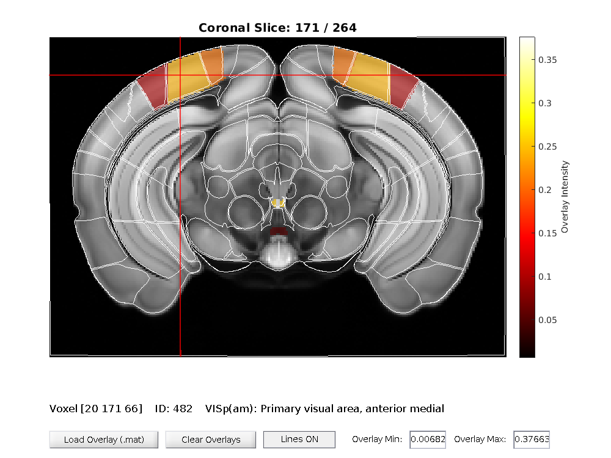
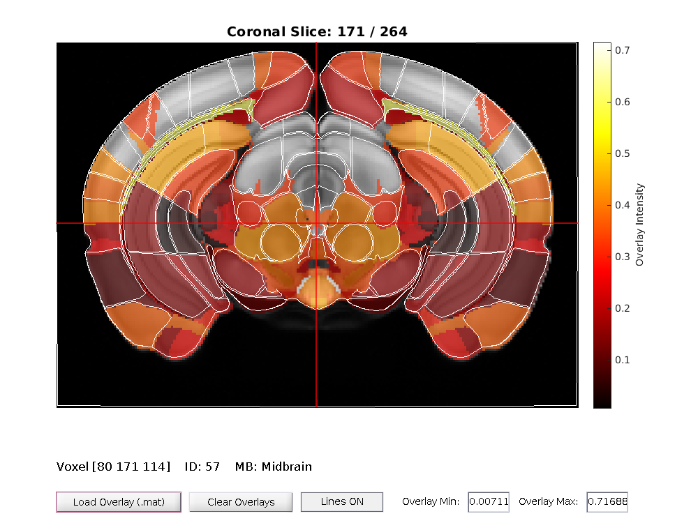
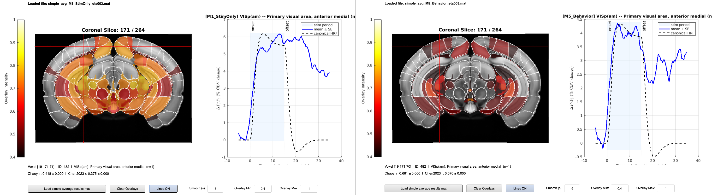
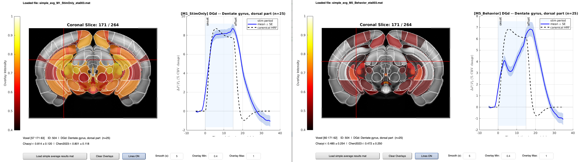

# Plausibility of the canonical HRF and comparison with FIR and loo-cv ridge regression

LC 20260828

The reviewer suggests that our procedure of carrying out GLM using
the canonical HRF (from Nunez-Elizalde 2022) might be too simplistic and might not appropriately capture the variability of the HRF across regions and stimuli, which in turn would yield a suboptimal advantage when using the motion as an (hrf-convolved) regressors to explain out the effect of motion.

The reviewer's advice is to test whether estimating the effect using
time-shifted delta functions would help separate motion from the actual
effect of the stimulus. In the simplest version, this leads to a FIR
analysis. One way of assessing whether the FIR brings any advantage with respect to the HRF is to compare the eta2 maps generated by either the canonical HRF or by the FIR. We will carry out this using the same method of 2D correlation used for our main result.

At the same time, this gives us also an opportunity to assess whether the canonical HRF represents an efficient approximation to the actual HRF. For this, we cannot use the HRF recovered by FIR, since the amount of hrf-convolved predictors is quite high (at most 30 for each one), which can lead to inaccurate beta values - when the aim is to reconstruct the HRF. Therefore in this case we will use ridge regression with LOO cross-validation, where the lambda optimization parameter is estimated from the testing portion of the trials.

The considered models are:
- **M1_AllStims** : including all stimuli, stationary and during running
- **M8_StationaryStims**
- **M5_Behavior** : regressing wheel speed and interaction with stimuli

## Similarity between HRF and FIR eta2 maps
We transformed the eta2 maps for the predictor of interest from the subject space to the allen space. Since not all subject cover the save voxels, we then calculated the mean eta2 image according to how many subjects are present in any voxel.

| Model | Spatial correlation (r) |
|---|---:|
| **M5_Behavior** | **0.84** |
| **M1_AllStims** | **0.96** |
| **M8_StationaryStims** | **0.78** |

*Spatial correlation of group-level average maps in Allen space.*

 

| Group | Median | IQR | Mean | Std |
|---|---:|---:|---:|---:|
| **M5_Behavior** | 0.82 | 0.24 | 0.72 | 0.24 |
| **M1_AllStims** | 0.98 | 0.02 | 0.96 | 0.05 |
| **M8_StationaryStims** | 0.81 | 0.17 | 0.78 | 0.17 |

*Average Spatial correlation across subjects.*

 

  
  

Similarity of eta2 within subject. Below we present one subject with high similarity and one with low similarity between HRF and FIR. Because of the not-perfect overlap across subjects, these images are more informative than the comparisong of the average eta2 in allen space.

In order to compare the pattern of activity across FIR and HRF glm, we normalized the eta2 values across the entire slice.

## Comparison of the HRF with peristimulus time course
The previous analyses support the methodological choice for the canonical HRF given the similarity with the maps generated using a FIR glm.

However this does not tell us about how good does the canonical HRF (hereafter cHRF) fit the stimulus-related variation in CBF, and about the effect on the convolved nuisance regressors on the haemodynamic response.

To answer these questions, we considered the peristimulus signal in a range from 5 seconds before the onset to 20 seconds after the offset. Since the visual stimuli lasted 15 seconds, a total of 30 seconds were considered for the peristimulus time course.  

For each allen region we averaged the signal across voxels according to the following:
- for regions with at least _n_ (default = 5) above-threshold eta2 (default = 0.03), we considered all the supra-threshold voxels
- for regions not satisfying the threshold condition, the 5% voxels with the highest eta2 in that region
Additionally, we smoothed the average signal using a moving window of 5 seconds. 

This average signal was then averaged across trials in each session and correlated to the convolved stimulus boxcar after smoothing with a moving window of 5s. These choices reflect those from a work by Chen et al. 2023 aimed to estimate the canonical HRF for BOLD in mice and rats.

Taking the average correlation across sessions allows us to plot a region-wise map of the correlation between the average signal and the convolved boxcar.

While the similarity between the empirical HRF (eHRF) and the cHRF was very high in regions expectedly higly associated with visual stimuli, it was also high in other regions not directly associated with the nature of the stimuli

However, denoising using the cHRF was evidently succesful in cortical regions clearly expected to be associated with visual stimuli. The images below represents the regions where the difference in the correlation between eHRF and cHRF was highest.

  
  

_**Left**: Primary visual regions where the correlation of eHRF ~ cHRF is higher in M5 (all stimuli with motion regression) with respect to M1 (all stimuli without nuisance regression). **Right**: Hippocampal regions where the correlation of eHRF ~ cHRF is higher when nuisance is not regressed (M1) than when it is regressed out during glm._

_**Left**: M1 including all stimuli without nuisance regression; **Right**: M5 including the nuisance parameters_

At the same time, such denoising drastically decreased the correlations for regions which are not directly associated with the visual stimuli.

_**Left**: M1 including all stimuli without nuisance regression; **Right**: M5 including the nuisance parameters_

As a methodological note: to isolate the signal of interest from unwanted physiological and motion artifacts, nuisance regression was performed using the parameters estimated in the M5 GLM. The clean time series, $Y_{\text{clean}}$, was obtained by subtracting the fitted nuisance model components—constructed by multiplying the nuisance design matrix ($X_{\text{nuisance}}$) by their corresponding parameter estimates ($\hat{\beta}_{\text{nuisance}}$)—from the raw observed time series ($Y$). 

$$Y_{\text{clean}} = Y - X_{\text{nuisance}} * \hat{\beta}_{\text{nuisance}}$$

Following nuisance removal, trial-level epochs were extracted using a fixed time window centered around each stimulus onset. These individual peristimulus time courses were then baseline-corrected relative to the pre-stimulus interval and averaged across trials to yield the mean regional signal response ($\Delta P / P_0$).