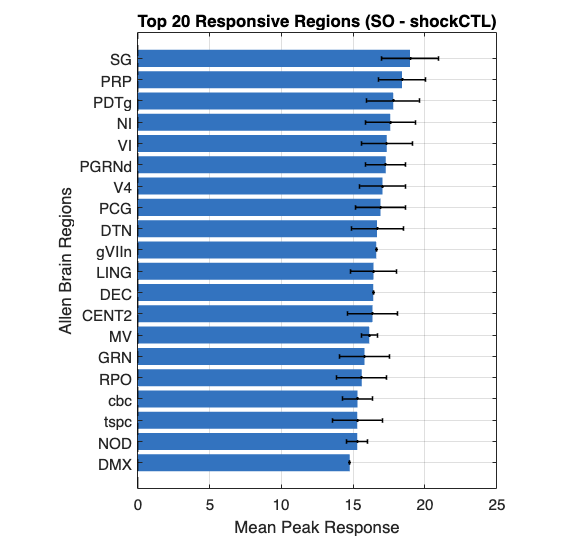
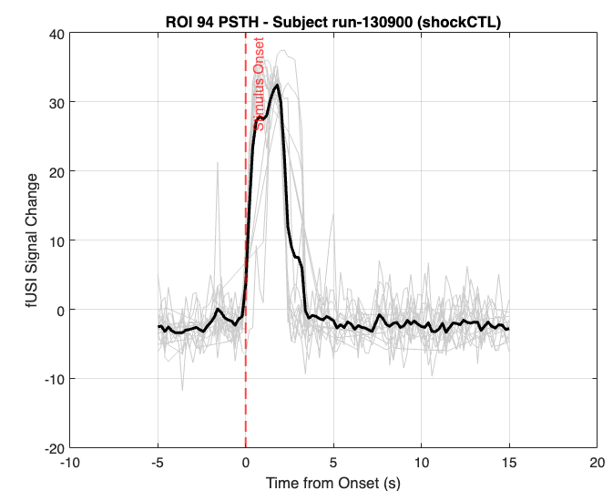
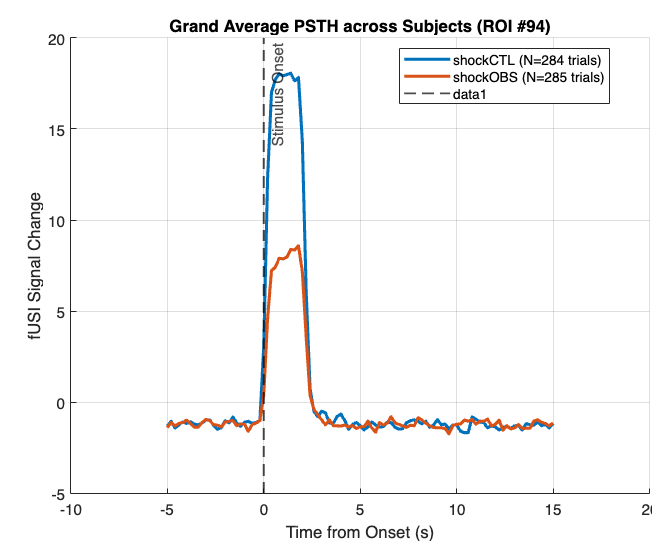

# Data for Tousif project

In the dyads folder `/data06/fUSIEmotionalContagion/Data_analysis` there are data from three experiments related to emotional contagion:

- **SO** : shock observation
- **FR** : fear recall
- **SS** : self shock

The aim is to retrieve the peristimulus signal for each of the 500+ region of the allen brain atlas.

Root of the analysis code is `/data08/fUSI/fUSI-Analysis/AnalysisFcn`.

We use as reference the code in `[root]/EmotionContagion/GLMEmotionContagion.m` which in turn uses `[root]/Datapath.m` to load the location where the `ROIprepPDI.mat` has been saved. This dataset has average (likely `mean`) time course for each allen region.

## Understanding data structure and code for model construction
After loading the data for one sub, we see that
- `PDI.PDI` has size 509-by-n_fUSI_frames, where 509 is the number of regions in the allen atlas

```
>> atlas.infoRegions
     rgb: [509x3 uint8]
     acr: {1x509 cell}
    name: {1x509 cell}
     vol: [701.8689 0.0166 2.3642 1.0513 1.3351 1.3991 0.4383 0.9856 ... ]
```

`PDI.stimInfo` informs about onset, offset and label of each stimulus

```
>> PDI.stimInfo
    startTime: [30x1 double]
      endTime: [30x1 double]
     stimCond: {30x1 cell}

>> PDI.stimInfo.stimCond
    {'shockCTL'}
    {'shockOBS'}
    {'shockOBS'}
    {'shockCTL'}
    ...
    {'shockCTL'}
    {'shockOBS'}
```

Importantly, the onset and offset time are **not** relative to the beginning of the fUSI acquisition, so t = 0 sec does **not** mark the start of the fUSI acquisition. Instead all the timings reflect the sec.msec from **start of the experiment** (i.e. the time in the first row of the `NIDAQ.csv` or equivalently the first rising edge in channel 5 or 6 of the `TTL*.csv` relative to that experiment). This is the case also for the timing of the fUSI acquisitions:

```
>> length(PDI.time)
9289

>> size(PDI.PDI)
509        9289

>> PDI.time(1:10)'
    8.7384
    8.9384
    9.1384
    9.3384
    9.5384
    9.7384
    9.9384
   10.1384
   10.3384
   10.5384
```

In order to map the timing of the offset onto a specific fUSI frame, the following code is used

```matlab
[~, onsetFrame] = arrayfun(@(x) min(abs(x - PDI.time)), PDI.stimInfo.startTime);
[~, offsetFrame] = arrayfun(@(x) min(abs(x - PDI.time)), PDI.stimInfo.endTime);
```


## Generating Model Predictors in Units of fUSI Frames
The script `extract_data_tousif.m` (not a function, therefore to be evaluated cell by cell) extracts the information for isolating the peristimulus time course across all three paradigms: SO, FR, SS.

### Structure Metadata & Spatial Alignment
Compared to the raw saved structs, we appended structured metadata including subject/session identifiers (`subjectID`) and original directory paths. Reference information from the Allen Brain Atlas is embedded in `metadata.atlasInfo`: each of the **509 rows** in the `fUSI` and `fUSI_clean` matrices ($509 \times N_{\text{frames}}$) corresponds to a specific anatomical region index.

### Frame-Aligned Predictors & Clock Mapping
To eliminate synchronization ambiguity when constructing design matrices or epoching trials, all stimulus events are mapped directly onto the fUSI frame clock (`fUSI_time`):
* **`mask`**: A binary logical array (`[1 x nFusiFrames]`) indicating active stimulus frames.
* **`onsetFrames` & `offsetFrames`**: Frame indices for extracting peri-stimulus windows within designated frame margins before/after event onsets.
* **`samplingRate` & `dt`**: Frame rate specifications ($\sim 5\text{ Hz}$, calculated via `mode(diff(fUSI_time))`) to convert frame indices into physical time units.

```
SO / FR / SS Dataset Hierarchy
├── metadata
│   ├── condition        : 'SO' | 'FR' | 'SS'
│   └── atlasInfo        : struct (atlas.infoRegions: acronym, name, rgb, volume)
│
└── sessions (Cell Array {nSubjects x 1})
    └── {isub} (struct)
        ├── subjectID    : 'run-XXXXXX'
        ├── dataPath     : original data folder path
        ├── anatPath     : original anat folder path
        ├── time         : [1 x nFusiFrames] double
        ├── dt           : mode(diff(time))
        ├── samplingRate : 1 / dt
        │
        ├── fUSI         : [509 x nFusiFrames] raw ROI time-series
        ├── fUSI_clean   : [509 x nFusiFrames] after regressing wheel speed
        │
        ├── wheel        : struct ('time', 'speed')
        │
        └── stimInfo
            ├── uniqueConds : {'shockCTL', 'shockOBS'} (varies by paradigm)
            └── cond (struct array, one element per unique condition)
                ├── name         : 'shockCTL'
                ├── mask         : [1 x nFusiFrames] logical
                ├── onsetFrames  : [nTrials x 1] double
                ├── offsetFrames : [nTrials x 1] double
                ├── onsetTimes   : [nTrials x 1] double
                └── offsetTimes  : [nTrials x 1] double
```

Once extracted for all three paradigms, each `[paradigm]_dataset.mat` file contains the following standardized condition and behavioral predictors:

| Paradigm | Condition Predictors (`stimInfo`) | Behavioral Confounders (`wheelInfo`) |
| :--- | :--- | :--- |
| **SO** (Shock Observation) | `shockCTL`, `shockOBS` | `Running` (raw speed), `ConvRunning` (HRF-convolved speed) |
| **FR** (Fear Recall) | `FearRecall` (parsed condition) | `Running` (raw speed), `ConvRunning` (HRF-convolved speed) |
| **SS** (Social Shock) | `Zero`, `Low`, `High` (intensity-based) | `Running` (raw speed), `ConvRunning` (HRF-convolved speed) |

---

## Vectorized Confound Removal Pipeline

While raw time-series (`fUSI`) contain preprocessed regional signal averages, locomotion artifacts significantly corrupt hemodynamics. The function `clean_fusi_data.m` fits an Ordinary Least Squares (OLS) GLM to remove running-induced signals across all 509 ROIs simultaneously.

### Execution
```matlab
% Run vectorized confound regression on dataset
clean_fusi_data(fullfile(pwd, 'SO_dataset.mat'));
clean_fusi_data(fullfile(pwd, 'FR_dataset.mat'));
clean_fusi_data(fullfile(pwd, 'SS_dataset.mat'));
```


### Mathematical Logic & Algorithm
1. **Design Matrix Construction**: Assembles design matrix:
$$X = [\mathbf{1}, X_{\mathrm{stim\_hrf}}, X_{\mathrm{Running}}, X_{\mathrm{ConvRunning}}]$$

2. **Baseline Slicing**: Excludes active stimulus frames (`sum(stim, 2) > 0`) when estimating regression weights ($\beta$). Estimating running parameters strictly on non-stimulus frames prevents stimulus-evoked neural responses from distorting locomotion coefficients.

3. **Vectorized Fitting**: Computes beta weights in a single matrix division step across all 509 regions simultaneously:
$$\beta = X_{\mathrm{baseline}} \backslash Y_{\mathrm{baseline}}$$

4. **Targeted Partialling Out**: Reconstructs locomotion signal contributions across the full time-course:
$$\hat{Y}_{\mathrm{running}} = \beta_{\mathrm{Running}} \cdot X_{\mathrm{Running}} + \beta_{\mathrm{ConvRunning}} \cdot X_{\mathrm{ConvRunning}}$$

and subtracts $\hat{Y}_{\mathrm{running}}$ from raw $Y$, saving the cleaned result directly into the `fUSI_clean` field of the dataset file:
$$Y_{\mathrm{clean}} = Y - \hat{Y}_{\mathrm{running}}$$


## Diagnostic Plotting & Quality Check

The self-standing visualization function `plot_fusi_onsets.m` allows rapid inspection of raw or cleaned time-series alongside color-coded stimulus onset stem plots:

```matlab
% Inspect raw fUSI signal and condition onsets for session 5
plot_fusi_onsets('SO_dataset.mat', 5, 'fUSI');

% Inspect cleaned fUSI signal post confound regression for the same session
plot_fusi_onsets('SO_dataset.mat', 5, 'fUSI_clean');
```

documentation_psth_section = """
## Generating the Dataset of Peristimulus Time Courses

Now we can extract the peristimulus signals for each experiment and each condition using `extract_peristimulus_dataset.m`:

```matlab
% Extract peristimulus timecourses with a -5s to +15s window around trial onsets
extract_peristimulus_dataset('SO_dataset.mat', 5, 15, 'fUSI_clean');
extract_peristimulus_dataset('FR_dataset.mat', 5, 15, 'fUSI_clean');
extract_peristimulus_dataset('SS_dataset.mat', 5, 15, 'fUSI_clean');
```

Where `5` and `15` specify the pre- and post-stimulus interval durations (in seconds), and `'fUSI_clean'` selects the locomotion-regressed signal source (falling back to `'fUSI'` for raw signals if specified).

This produces a structured dataset file (e.g., `SO_peristimulus_dataset.mat`) organized as follows:

```
SO_peristimulus_dataset
├── metadata
│   ├── condition        : 'SO'
│   ├── signalSource     : 'fUSI_clean' (or 'fUSI')
│   ├── preStimSec       : 5
│   ├── postStimSec      : 15
│   ├── preFrames        : 25
│   ├── postFrames       : 75
│   ├── nPSTHFrames      : 101  (preFrames + 1 + postFrames)
│   ├── timeVec          : [-5.0, -4.8, ..., 0.0, ..., 15.0]  (1 x 101 double)
│   └── atlasInfo        : struct (509 Allen ROIs info)
│
└── sessions (Cell Array {nSubjects x 1})
    └── {isub} (struct)
        ├── subjectID    : 'run-XXXXXX'
        ├── dataPath     : original data path
        ├── anatPath     : original anat path
        │
        └── periSignal (1 x nConditions struct array)
            ├── condName    : 'shockCTL'
            ├── signal      : [509 x 101 x nTrials] double
            ├── nTrials     : scalar double
            └── trialOnsets : [nTrials x 1] frame indices
```

## Using the peristimulus timecourses dataset

### Example 1: Inspecting the regions with the max hrf response across subjects
Not all 509 regions have signal, and we are also most interested only in specific regions which show a response to the stimulus. To have an initial idea of which regions to inspect, we can run the `plot_regional_peak_histogram(psthFilePath, condIdx, topN)` script, e.g.

```matlab
% first argument : the dataset name/path
% second argument : the index of the condition
% third argument : show a histogram of the top n regions by mean(max(hrf))
plot_regional_peak_histogram('SO_peristimulus_dataset.mat',1, 20)
```



### Example 2: Plotting PSTH for a Single Subject & ROI

To inspect trial-by-trial responses and the mean PSTH curve for a specific ROI (e.g., region index 94) in a single session:

```matlab
% Load dataset
data = load('SO_peristimulus_dataset.mat');
psthStruct = data.SO_peristimulus;

roiIdx = 94; % Specific Allen ROI index
isub = 1;   % Subject index
ic = 1;     % Condition index ('shockCTL')

% Extract tensor: [509 x 101 x nTrials] -> [101 x nTrials]
roiTrials = squeeze(psthStruct.sessions{isub}.periSignal(ic).signal(roiIdx, :, :));
timeVec   = psthStruct.metadata.timeVec;

% Compute Mean and SEM across trials
meanTrace = mean(roiTrials, 2, 'omitnan');
semTrace  = std(roiTrials, 0, 2, 'omitnan') / sqrt(size(roiTrials, 2));

% Plot mean PSTH response with shaded error bar
figure('Color', 'w');
plot(timeVec, roiTrials, 'Color', [0.8 0.8 0.8], 'LineWidth', 0.5); hold on;
plot(timeVec, meanTrace, 'k-', 'LineWidth', 2, 'DisplayName', 'Mean Response');
xline(0, 'r--', 'Stimulus Onset', 'LineWidth', 1.2);
xlabel('Time from Onset (s)');
ylabel('fUSI Signal Change');
title(sprintf('ROI %d PSTH - Subject %s (%s)', roiIdx, ...
      psthStruct.sessions{isub}.subjectID, ...
      psthStruct.sessions{isub}.periSignal(ic).condName), 'Interpreter', 'none');
grid on;
```




---

### Example 3: Aggregating Grand-Average Responses Across All Subjects

To compute and plot grand-average PSTH curves across all animals for every condition in an experiment:

```matlab
% Load PSTH dataset
data = load('SO_peristimulus_dataset.mat');
psthStruct = data.SO_peristimulus;

roiIdx = 1; % Region index to plot
timeVec = psthStruct.metadata.timeVec;
nConds = numel(psthStruct.sessions{1}.periSignal);

figure('Color', 'w'); hold on;
colors = lines(nConds);

for ic = 1:nConds
    % Concatenate trials from all subjects into a single matrix [101 x totalTrials]
    allSubjectTrials = cellfun(@(s) squeeze(s.periSignal(ic).signal(roiIdx, :, :)), ...
                               psthStruct.sessions, 'UniformOutput', false);
    grandTrialMatrix = cat(2, allSubjectTrials{:});
    
    % Grand Mean and SEM
    grandMean = mean(grandTrialMatrix, 2, 'omitnan');
    grandSEM  = std(grandTrialMatrix, 0, 2, 'omitnan') / sqrt(size(grandTrialMatrix, 2));
    
    % Plot grand mean PSTH
    condName = psthStruct.sessions{1}.periSignal(ic).condName;
    plot(timeVec, grandMean, 'Color', colors(ic, :), 'LineWidth', 2, ...
         'DisplayName', sprintf('%s (N=%d trials)', condName, size(grandTrialMatrix, 2)));
end

xline(0, 'k--', 'Stimulus Onset', 'LineWidth', 1.2);
xlabel('Time from Onset (s)');
ylabel('fUSI Signal Change');
title(sprintf('Grand Average PSTH across Subjects (ROI #%d)', roiIdx));
legend('Location', 'best');
grid on;
```



