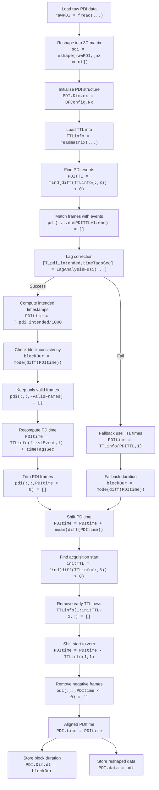

# Raw2PDI

I would like to know which directories I can use to test
- PDI reconstruction (is it the same for anatomical and functional?)
- Registration
- Preprocessing
- Functional analysis (GLMs)


## Overview of the Script Purpose

The main goal of this script is to **create the PDI structure**, which consolidates imaging, stimuli, and sensor information into a single object for downstream analysis.


### Flow of raw2mat

```
ses-231219
│
├── run-153501
│   ├── FUSI_data
│   │   ├── L22-14_PlaneWave_FUSI_data.mat
│   │   ├── fUS_block_PDI_float.bin
│   │   └── post_L22-14_PlaneWave_FUSI_data.mat
│   │
│   ├── MotorScan.csv
│   ├── NIDAQ.csv
│   └── TTL20231219T153455.csv
│
└── run-155815
    ├── DAQ.csv
    ├── FUSI_data
    │   ├── L22-14_PlaneWave_FUSI_data.mat
    │   ├── fUS_block_PDI_float.bin
    │   └── post_L22-14_PlaneWave_FUSI_data.mat
    │   
    ├── GSensor.csv
    ├── RunningWheel.csv
    ├── TTL20231219T155811.csv
    └── VisualStimulation.csv
```

- Select a run dir inside the Data Collection
    - the savepath is automatically configured in the same dir in Data Analysis

- Read data (ttlinfo and rawPDI) + parameters
    - Load scan parameters from `L22-14_PlaneWave_FUSI_data.mat`
    - Read rawPDI in bin format from the `FUSI_data` subdir
    - Read TTLinfo from TTL*
    - Read NIDAQ Logfile


- Fixing pdi
    - Alignment btw pdi and ttlinfo
    - Correct for Lagged PDI and interpolate
    - Adjust PDI time

- Add other recorded information
    - Shock
    - Visual
    - Auditory
    - Pupil camera
    - Wheel
    - Gsensor

- Save everything into the PDI data structure in savedatapath


### PDI Contains

1. **PDI frames and their timing**
   - Source: `fUS_block_PDI_float.bin` (raw PDI data)
   - TTL channels and NIDAQ provide precise timing references.
   - Lag correction and timestamp adjustment align the PDI frames with the experiment.
   - Stored as:
     - `PDI.PDI` → reshaped PDI frames
     - `PDI.time` → aligned timestamps
     - `PDI.Dim.dt` → average frame interval

2. **Stimuli information and timing**
   - Shock, visual, and auditory stimulation CSV files (with fallback to TTL/NIDAQ)
   - Start/end times and condition labels
   - Stored as `PDI.stimInfo`

3. **Other sensor data**
   - **Flir camera** → pupil timestamps (`PDI.pupil.pupilTime`)
   - **Wheel encoder** → running speed (`PDI.wheelInfo`)
   - **G-sensor** → headplate motion (`PDI.gsensorInfo`)
   - All aligned to the same time base defined by NIDAQ / TTL

The script **reads multiple sources, corrects timing discrepancies, and merges everything into `PDI`**, producing a single, synchronized dataset for analysis.


## Column names in TTlinfo
What is the column name of each column in TTLinfo? I need to change them in `Utils_LC/TTLinfo_colNames`

```matlab
names = { ...
    'Time', ...
    '2', ...
    'Events', ...
    'ShockOBSCTLStim', ...
    'ShockTailStim', ...
    'AdjustPDItime', ...
    '7', ...
    '8', ...
    '9', ...
    'VisualStim', ...
    'AuditoryStim', ...
    'Shock', ...
    '13' ...
};
```

- col 3 : What are the 'Events'
- col 5, 12 : tail Shockstimulation
- TTLinfo 5 is used both for shocktail and for adjusting PDItime. Why?
- col 5 and are is used in adjusting PDItime (but the code is problematic). What is it?


## What does the NIDAQ.csv file contain?
| time             | value    |                     |
| ---------------- | -------- | ------------------- |
| 1702996522.86444 | 11100101 | {'ZaberScan': 3.75} |
| 1702996522.86444 | 11100100 | {'ZaberScan': 3.75} |
| 1702996527.84726 | 11100101 | {'ZaberScan': 4.0}  |
| 1702996527.84726 | 11100100 | {'ZaberScan': 4.0}  |


## Read TTL Timing Information - pdi movie: different slices?

If I play the reconstructed pdi as a movie, it looks to me like there is a change in slices. Is that correct? Is it the 'anatomical'? How many time points are in each slice? (so that I can make a 4D)

## Realign Events Using TTL Information

```matlab
PDITTL = find(diff(TTLinfo(:,3)) < 0);
numPDITTL = numel(PDITTL);
numPDIframes = size(pdi, 3);

if numPDITTL < numPDIframes
    pdi(:, :, numPDITTL+1:end) = [];
elseif numPDITTL > numPDIframes
    PDITTL(numPDIframes+1:end) = [];
end
```

- The code first counts the number of times the signal goes from 0 to 1
- That's the number of TTL
- Why the third column is used? What does it contain?
- Then there is the part where either events or time frames are cut. Why so?


## Correct for Lagged PDI and Interpolate

the section `Correct for Lagged PDI and Interpolate` section gives a lot of errors (`Could not find all blocks`)


## Adjust PDItime

This section breaks with an error. Is it maybe dependent on the previous one?

```matlab
% Find the first rising edge in TTL channel 6
% diff > 0 detects transitions from 0 → 1
initTTL = find(diff(TTLinfo(:,6)) > 0); % returns many
initTTL = find(diff(TTLinfo(:,6)) > 0, 1, 'first');  % first rising edge only

% If channel 6 has no rising edge, try channel 5
if isempty(initTTL)
    initTTL = find(diff(TTLinfo(:,5)) > 0);
end

% Remove all TTL entries before the first acquisition event
TTLinfo(1:initTTL-1, :) = [];
```

If run it like this,`initTTL = find(diff(TTLinfo(:,6)) > 0)` returns many values, and `TTLinfo(1:initTTL-1, :)` breaks.

Should we detect only the first rising edge? I.e. using `initTTL = find(diff(TTLinfo(:,6)) > 0, 1, 'first');  % first rising edge only`


## PDI Diagrams

<details>
<summary>Show PDI Processing Flowchart</summary



</details>


# Registration

## Practical details about when the registration is carried out
From the manuscript, I understand that the registration is actually done during the habituation period, which probably means that this procedure is carried out several times in order to find the desired slice. How is this carried out practically during the experiment?


