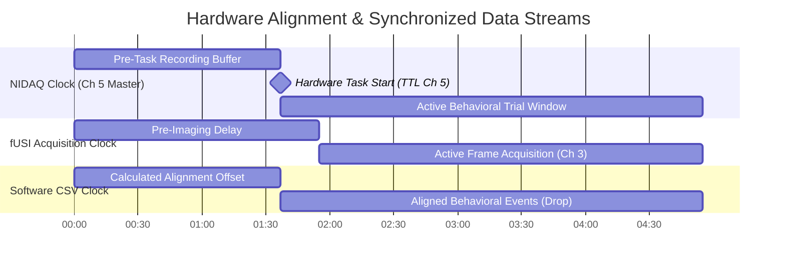
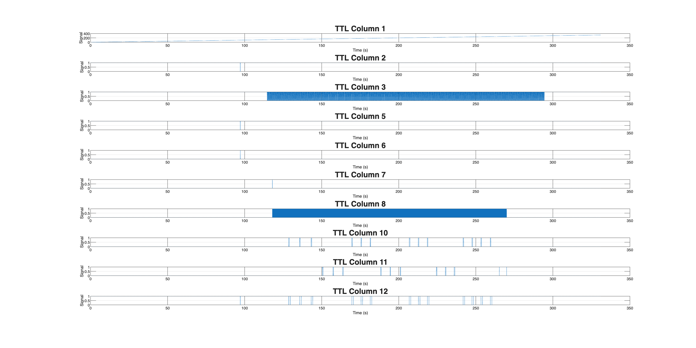
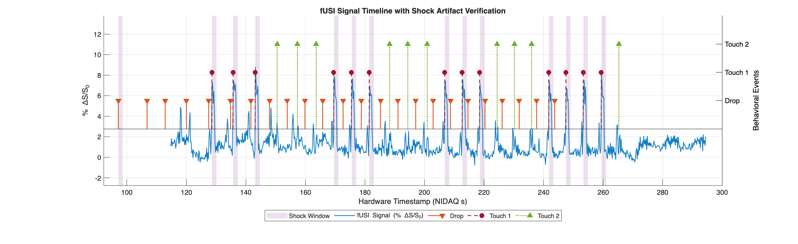

# `functional_reconstruction.m`
**NB**: We develop `functional_reconstruction.m` on what was previously called `Rawdata2MATnew.m`. The dev history is in the `OLE` dir and starts with the original `Rawdata2MATnew_V0_Chaoyi.m`. 

Data location:
```
~/Dropbox/fUSI/data/fUSIHarmAversion/Data_collection/sub-mockexperiment/ses-999999/run-155150-func

and 

/data03/fUSIHarmAversion/Data_collection/sub-mockexperiment/ses-999999/run-155150

$ tree
.
├── DAQ.csv
├── DropletStimulation.csv
├── FUSI_data
│   ├── L22-14_PlaneWave_FUSI_data.mat
│   ├── fUS_block_PDI_float.bin
│   └── post_L22-14_PlaneWave_FUSI_data.mat
├── FUS_EXPERIMENT
├── TTL20260908T155016.csv
├── Touchsensor.csv
├── __SUCCESS
├── experiment_config.json
└── settings.json
```


## `experiment_config.json`
In order to reconstruct the functional scan it is now **mandatory to have an appropriate `experiment_config.json` in the raw data folder**. 

This file has default values for filenames and TTL channels, however these default values can be modified for a specific experiment, therefore it should be carefully checked in advance. 

In order to keep the file simple, it is advised to keep only the information relevant to each specific session (e.g. `visual_stimuli` or `droplet_stimuli`).


<details><summary>default_experiment_config.json</summary>

```json
{
  "experiment_id": "run-xxxxxx",
  "date": "YYYY-MM-DD",
  "processing_parameters": {
    "min_stim_duration_sec": 0.01,
    "min_event_timestamp_sec": 0.1,
    "pdi_frame_channel": 3
  },
  "file_names": {
    "fusi_folder_pattern": "FUSI_data*",
    "pdi_binary": "fUS_block_PDI_float.bin",
    "scan_params": [
      "post_L22-14_PlaneWave_FUSI_data.mat",
      "L22-14_PlaneWave_FUSI_data.mat"
    ],
    "ttl_pattern": "TTL*.csv",
    "nidaq_log": ["NIDAQ.csv", "DAQ.csv"]
  },
  "stimuli": {
    "fus_stimuli": {
      "csv_filename": "FUStimulation.csv",
      "TTL_channel": [4, 5, 12]
    },
    "shock_tail_stimuli": {
      "csv_filename": "ShockStimulation.csv",
      "metadata_excel": "shockIntensities_and_perceivedSqueaks.xlsx",
      "TTL_channel": [5, 12]
    },
    "shock_paw_stimuli": {
      "csv_filename": "ShockStimulation.csv",
      "TTL_channel": [4, 12]
    },
    "visual_stimuli": {
      "csv_filename": "VisualStimulation.csv",
      "TTL_channel": 10
    },
    "audio_USV_stimuli": {
      "csv_filename": "AudioStimulation.csv",
      "TTL_channel": 11
    },
    "droplet_stimuli": {
      "csv_filename": "DropletStimulation.csv",
      "TTL_channel_launch": [2, 5, 6],
      "TTL_channel_touch1": 10,
      "TTL_channel_touch2": 11,
      "TTL_channel_shock": 12
    }
  },
  "behaviour": {
    "pupil_camera": {
      "csv_filename": "pupil_camera.csv"
    },
    "running_wheel": {
      "csv_filename": "RunningWheel.csv"
    },
    "gsensor": {
      "csv_filename": "GSensor.csv"
    }
  }
}
```

</details>

## Mandatory files for reconstruction
- **experiment_config.json**
Configuration file defining acquisition thresholds, target file patterns, 
and mappings for optional stimuli and behavioral recordings.

- **fUS_block_PDI_float.bin** (inside 'FUSI_data*' folder) :
Raw binary float file containing unshaped 1D power Doppler intensity (PDI) 
data streamed directly from the fUSI scanner.

- **post_L22-14_PlaneWave_FUSI_data.mat OR L22-14_PlaneWave_FUSI_data.mat** (inside 'FUSI_data*' folder) :
MATLAB scanner metadata file containing beamforming configurations (BFConfig). 
Provides grid dimensions (Nx, Nz) and spatial resolutions (ScaleX, ScaleZ) 
used to reshape the 1D binary PDI stream into a 3D matrix [Nz x Nx x Nt].

- **TTL\*.csv** :
High-frequency (5 kHz) hardware signal matrix logged by NIDAQ. Used to detect 
falling edges on the frame acquisition channel to align fUSI volume counts, 
and to extract exact hardware onset/offset timing for stimuli via assigned channels.

- **NIDAQ.csv OR DAQ.csv** :
Software acquisition log recorded by the DAQ program. Contains system clock 
timestamps marking the start of logging session (NIDAQInfo.time(1)), serving as 
a time-zero reference and timestamp fallback when hardware TTL channels are unused.


## Realignment of TTLinfo with other data (e.g. csv)
```
[NIDAQ Armed] ---------- delay --------------> [Behavioral Task Launched]
  |                                                                        |
  +-- NIDAQInfo.time(1)  (System Epoch Time)   +-- dropTable.time(1)
  +-- TTLinfo time = 0.0s (Hardware Counter)   +-- Software starts logging events
```





To perform accurate GLM analysis and event-related averaging, behavioral events logged by external software (CSV files) must be aligned with high temporal fidelity to the fUSI imaging frames on the master NIDAQ hardware clock ($t = 0.0$).

### 1. Clock Domains & The Alignment Problem

Three asynchronous processes run during an experimental session:
1. **NIDAQ Clock (Master Baseline):** Starts recording at $t = 0.0$ when the acquisition system is armed.
2. **Behavioral PC (CSV Clock):** Logs events (`dropInfo`, `touch1Info`, `touch2Info`, `shockInfo`) using system epoch time after a launch delay.
3. **fUSI Imaging System:** Begins acquiring frames on Channel 3 after a manual or automated pre-imaging delay.

Because there is a variable delay between arming the NIDAQ board and launching the behavioral task executable, software CSV timestamps cannot be directly mapped to NIDAQ array indices without dynamic realignment.

---

### 2. Alignment Logic

When the behavioral task launches, the behavioral PC sends a physical digital trigger to **NIDAQ Channel 5**. The pipeline detects the rising edge of this trigger ($t_{\\text{Ch5\\_TTL}}$) to dynamically anchor software logs to the NIDAQ clock.

The dynamic time offset is computed as:

$$Offset = t_{Ch5\_TTL} - (csv_{start\_time} - NIDAQ\_start)$$

Where:
* $t_{Ch5\_TTL}$ is the exact hardware timestamp (in seconds) of the rising edge on NIDAQ Channel 5.
* $csv_{start\_time}$ is the epoch timestamp of the first logged behavioral event.
* $NIDAQ\_start$ is the epoch timestamp recorded when the NIDAQ arming signal was initialized.

---

### 3. Unified Cross-Modal Timeline Construction

Once `Offset` is established, all continuous and discrete data streams are mapped onto a single, perfectly aligned NIDAQ time vector ($t_{hardware}$):

* **fUSI Signal (`pdi2d`):** Frame $i$ timestamp extracted directly from the rising edges of **TTL Channel 3** pulses.

* **Droplets (`dropInfo`):** $t_{aligned} = t_{CSV + Offset}$

* **Touch 1 / Touch 2 (`touch1Info`, `touch2Info`):** Timestamps extracted from **TTL Channels 10 & 11**, verified against shifted CSV software events.

* **Shock Artifacts (`shockInfo`):** Timestamps extracted from **TTL Channel 12**, marking exact frames subjected to electrical shock interference for downstream artifact removal (e.g., ICA / GLM regression).

This dynamic offset alignment ensures sub-millisecond precision across all modal predictors, enabling unified visualization and robust GLM feature matrix generation.


## Verifying the realignment
In the `add_droplet_shock.m` we made some test to verify the alignment. To run the following, you must have previously run the `Rawdata2MATnew_V[last].m` up to the point before the stimuli are detected and mapped in the PDI.

The following code gives an overview of the channels:

<details><summary>code</summary>

```matlab
% 1. Find which columns have any non-zero values
activeCols = find(any(TTLinfo ~= 0, 1));
fprintf('Columns with non-zero values: %s\n', mat2str(activeCols));

% 2. Find which columns actually change state (digital transitions)
varyingCols = find(std(TTLinfo, 0, 1) > 0);
fprintf('Columns with signal state changes: %s\n', mat2str(varyingCols));


%% Cell 2: Visual Inspection of Active TTL Channels
% WHAT WE ARE TESTING:
%   Plot all active TTL channels to visually map hardware signals to behavioral events.
%
% WHAT RUNNING THIS CODE REVEALS:
%   - Column 1: Hardware time vector (seconds).
%   - Columns 3 & 8: fUSI frame acquisition triggers (PDI signal).
%   - Columns 2, 5, 6: Dual handshake pulses around ~97 s marking software launch.
%   - Column 7: Single event marker at ~118 s.
%   - Column 10: Touch sensor 1 (touch1 - shock-paired dispenser).
%   - Column 11: Touch sensor 2 (touch2 - safe dispenser).
%   - Column 12: Shocker box activation (shock).

figure('Name', 'TTL Channel Inspector');
for i = 1:numel(varyingCols)
    colIdx = varyingCols(i);
    subplot(numel(varyingCols), 1, i);
    plot(TTLinfo(:, 1), TTLinfo(:, colIdx)); 
    title(sprintf('TTL Column %d', colIdx));
    xlabel('Time (s)');
    ylabel('Signal');
    grid on;
end
```

</details>
<br>



This plots reveals/suggests that
- Column **1**: Hardware time vector (seconds).
- Columns **3 & 8**: fUSI frame acquisition triggers (PDI signal).
- Columns **2, 5, 6**: Dual handshake pulses around ~97 s marking software launch.
- Column **7**: Single event marker at ~118 s.
- Column **10**: Touch sensor 1 (touch1 - shock-paired dispenser).
- Column **11**: Touch sensor 2 (touch2 - safe dispenser).
- Column **12**: Shocker box activation (shock).

We also know that the shock induces an artifact in the fUSI signal. This can be used as a final source of verification of the correct realignment.

Run this _after_ mapping the stimuli in `Rawdata2MATnew_V[last].m`, since the information is now taked from `PDI.stimInfo`

<details><summary>code shock artifact</summary>

```matlab
%% EXTRA CHECK FOR DROPLET PARADIGM

%% Visualization of fUSI Signal & Behavioral Events Highlighting the artifact ---
figure('Color', 'w', 'Position', [100 100 1200 600]);

% -------------------------------------------------------------------------
% 0. RESHAPE PDI vox-by-time AND TAKE THE MEAN/MEDIAN
%    TO HIGHLIGHT THE SHOCK ARTIFACT ON FUSI SIGNAL
% -------------------------------------------------------------------------

pdi2d = reshape(PDI.PDI, [PDI.Dim.nx * PDI.Dim.nz, PDI.Dim.nt]);
% imagesc(pdi2d); colormap gray
% plot(median(pdi2d, 1))

% -------------------------------------------------------------------------
% 1. TIME VECTOR & SIGNAL NORMALIZATION (% dS/S)
% -------------------------------------------------------------------------
frameChan = cfg.processing_parameters.pdi_frame_channel;
if exist('TTLinfo', 'var') && size(TTLinfo, 2) >= frameChan
    fusiTime = TTLinfo(diff(TTLinfo(:, frameChan)) > 0, 1);
    if numel(fusiTime) ~= size(pdi2d, 2)
        fusiTime = linspace(TTLinfo(1,1), TTLinfo(end,1), size(pdi2d, 2));
    end
else
    fusiTime = 1:size(pdi2d, 2);
end

rawSignal = median(pdi2d, 1);
% Calculate % Change from baseline (using 5th percentile as S0)
s0 = prctile(rawSignal, 5); 
fusiSignal_dS = ((rawSignal - s0) / s0) * 100; 

% -------------------------------------------------------------------------
% 2. DRAW SHOCK ARTIFACT SHADING BACKGROUND
% -------------------------------------------------------------------------
hold on
c_shock = [0.4940 0.1840 0.5560]; % Purple

yLimits = [min(fusiSignal_dS)-2, max(fusiSignal_dS)+5];

if isfield(PDI.stimInfo, 'shockInfo') && ~isempty(PDI.stimInfo.shockInfo)
    shockStarts = PDI.stimInfo.shockInfo.startTime;
    shockDuration = 1.5; % 1.5s highlight window
    
    for s = 1:numel(shockStarts)
        x_patch = [shockStarts(s), shockStarts(s)+shockDuration, shockStarts(s)+shockDuration, shockStarts(s)];
        y_patch = [yLimits(1), yLimits(1), yLimits(2), yLimits(2)];
        
        if s == 1
            patch(x_patch, y_patch, c_shock, 'FaceAlpha', 0.15, 'EdgeColor', 'none', 'DisplayName', 'Shock Window');
        else
            patch(x_patch, y_patch, c_shock, 'FaceAlpha', 0.15, 'EdgeColor', 'none', 'HandleVisibility', 'off');
        end
    end
end

% -------------------------------------------------------------------------
% 3. PLOT CONTINUOUS fUSI SIGNAL (Left Y-Axis)
% -------------------------------------------------------------------------
yyaxis left

% plot(fusiTime, fusiSignal_dS, 'Color', [0.15 0.15 0.15 0.5], 'LineWidth', 1.1, 'DisplayName', 'fUSI Signal (% \DeltaS/S_0)');
plot(fusiTime, fusiSignal_dS, 'Color', [0.00 0.45 0.74 0.9], 'LineWidth', 1.1, 'DisplayName', 'fUSI Signal (% \DeltaS/S_0)');

ylabel('% \DeltaS/S_0');
ylim(yLimits);
ax = gca;
ax.YColor = [0.15 0.15 0.15];

% -------------------------------------------------------------------------
% 4. PLOT DISCRETE EVENTS (Right Y-Axis)
% -------------------------------------------------------------------------
yyaxis right
ylabel('Behavioral Events');
ax.YColor = 'k';

y_drop = 1;
y_t1   = 2;
y_t2   = 3;

c_drop = [0.8500 0.3250 0.0980]; % Orange
c_t1   = [0.6350 0.0780 0.1840]; % Red (Touch 1)
c_t2   = [0.4660 0.6740 0.1880]; % Green (Touch 2)

if isfield(PDI.stimInfo, 'dropInfo') && ~isempty(PDI.stimInfo.dropInfo)
    stem(PDI.stimInfo.dropInfo.startTime, repmat(y_drop, height(PDI.stimInfo.dropInfo), 1), ...
        'Color', c_drop, 'Marker', 'v', 'MarkerFaceColor', c_drop, 'LineWidth', 1.2, 'DisplayName', 'Drop');
end

if isfield(PDI.stimInfo, 'touch1Info') && ~isempty(PDI.stimInfo.touch1Info)
    stem(PDI.stimInfo.touch1Info.startTime, repmat(y_t1, height(PDI.stimInfo.touch1Info), 1), ...
        'Color', c_t1, 'Marker', 'o', 'MarkerFaceColor', c_t1, 'LineWidth', 1.2, 'DisplayName', 'Touch 1');
end

if isfield(PDI.stimInfo, 'touch2Info') && ~isempty(PDI.stimInfo.touch2Info)
    stem(PDI.stimInfo.touch2Info.startTime, repmat(y_t2, height(PDI.stimInfo.touch2Info), 1), ...
        'Color', c_t2, 'Marker', '^', 'MarkerFaceColor', c_t2, 'LineWidth', 1.2, 'DisplayName', 'Touch 2');
end

% Position markers cleanly above signal
ylim([-2 4]); 
yticks([y_drop, y_t1, y_t2]);
yticklabels({'Drop', 'Touch 1', 'Touch 2'});

% % Uncomment the line below to plot only when there is fusi signal
% xlim([min(fusiTime), max(fusiTime)]);

% -------------------------------------------------------------------------
% 5. FORMATTING & LEGEND
% -------------------------------------------------------------------------
xlabel('Hardware Timestamp (NIDAQ s)');
title('fUSI Signal Timeline with Shock Artifact Verification');
grid on;
box off;
legend('Location', 'southoutside', 'Orientation', 'horizontal');


hold off;
```

</details>
<br>

